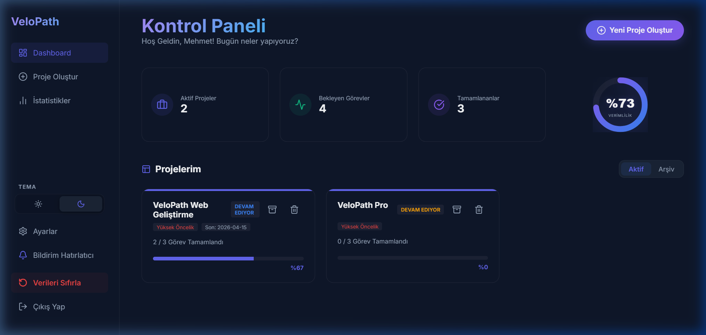
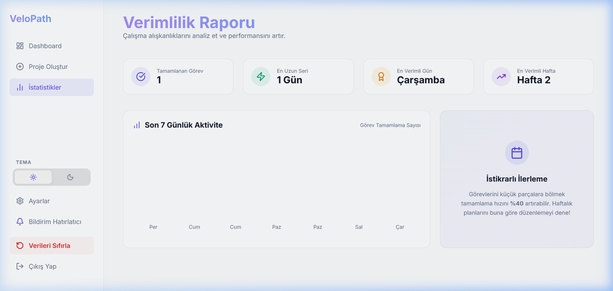
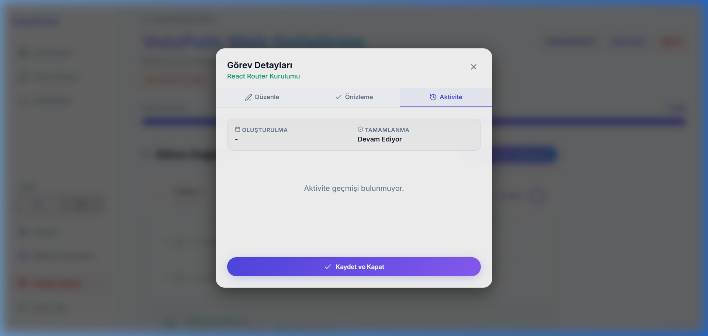
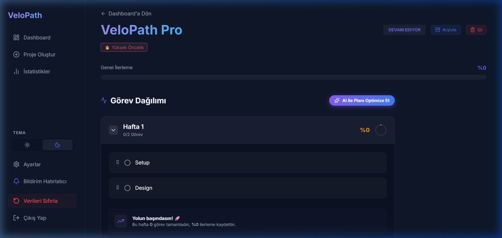

# VeloPath 🚀

**VeloPath**, kullanıcıların projelerini haftalık bazda akıllıca planlayabileceği, görevlerini sürükle-bırak yöntemiyle yönetebileceği ve ilerlemelerini dinamik olarak takip edebileceği **profesyonel** bir proje yönetim sistemidir.

---

## ✨ Ana Özellikler

VeloPath, en iyi modern kullanıcı deneyimini (UX) sunmak için Linear ve Vercel esintili tasarım trendleriyle inşa edilmiştir:

- 📊 **Haftalık Plan Görünümü:** Her projeyi haftalara bölün ve dairesel grafiklerle ilerlemeyi takip edin.
- 🏗️ **Sürükle-Bırak (Drag & Drop):** `@dnd-kit` ile görevlerinizi haftalar arası veya içinde pürüzsüzce sıralayın.
- 📜 **Görev Aktivite Geçmişi:** Her görevin ne zaman oluşturulduğu, tamamlandığı veya taşındığına dair detaylı zaman çizelgesi (Timeline) günlüğü.
- 📝 **Markdown Görev Notları:** Görevlerinize özel, zengin metin düzenleyicisi ile detaylı notlar ekleyin.
- 🔔 **Bildirim Hatırlatıcı:** Browser Notification API ile "Haftalık Görev Özeti" bildirimleri alın.
- 🚀 **Karşılama Sihirbazı (Onboarding):** Yeni kullanıcılar için 4 adımlı interaktif uygulama rehberi.
- 📈 **İstatistik ve Verimlilik Paneli:** Tamamlanan görev sayıları, en uzun çalışma seriniz (Streak) ve en verimli günlerinizin detaylı analizi.
- 🔗 **Görev Bağımlılıkları:** Görevler arası hiyerarşi ve kilit sistemi (Dependency) ile hata payını sıfırlayın.
- 📁 **Akıllı Proje Şablonları:** Tek tıkla Web, Mobil veya Full-Stack proje taslağınızı oluşturun.
- ☀️🌙 **Kalıcı Tema Sistemi:** MacOS tarzı modern arayüzle Aydınlık ve Karanlık mod arasında geçiş yapın.
- ⚡ **Hızlı Aksiyonlar:** Görevleri hızlıca silebilir, proje durumlarını anlık güncelleyebilirsiniz.
- 🔄 **Gelişmiş Veri Yönetimi:** "Verileri Sıfırla" butonu ile Local Storage senkronizasyonunu tek tıkla onarın.
- 💾 **Kalıcı Veri:** Tüm verileriniz `Local Storage` üzerinde güvenle saklanır.
- 🎨 **Boş Durum Tasarımı (Empty States):** Henüz veri yokken kullanıcıyı yönlendiren şık illüstrasyonlar ve aksiyon butonları.

---

## 📸 Ekran Görüntüleri

### 1. Modern Dashboard ve Verimlilik Takibi
Yenilenmiş dairesel ilerleme göstergeleri, bildirim hatırlatıcı ve pürüzsüz proje kartları.


### 2. Karşılama Sihirbazı (Onboarding)
Yeni kullanıcılar için hazırlanan, uygulamanın temel özelliklerini anlatan interaktif sihirbaz.


### 3. İstatistik ve Verimlilik Paneli
Kullanıcı istikrarını analiz eden detaylı metrikler ve son 7 günlük aktivite grafiği.


### 4. Görev Aktivite Geçmişi (Timeline)
Görevlerin tüm yaşam döngüsünü takip edebileceğiniz detaylı zaman çizelgesi günlüğü.


### 5. Haftalık Planlama Arayüzü
Projelerin haftalık bazda pürüzsüz organizasyonu ve sürükle-bırak desteği.


---

## 🛠️ Teknoloji Yığını

- **Frontend:** React.js
- **Sürükle-Bırak:** @dnd-kit
- **Metin Düzenleme:** React Markdown
- **İkonlar:** Lucide-React
- **Tasarım:** Vanilla CSS (Modern Glassmorphism)
- **State Yönetimi:** React Hooks

---

## 🚀 Kurulum ve Çalıştırma

Projeyi yerel ortamınızda çalıştırmak için şu adımları izleyin:

1. **Depoyu Klonlayın**
   ```bash
   git clone https://github.com/mehmeteminyilmaz/VeloPath.git
   cd VeloPath
   ```

2. **Bağımlılıkları Yükleyin**
   ```bash
   cd web
   npm install
   ```

3. **Uygulamayı Başlatın**
   ```bash
   npm start
   ```

---

## 📄 Lisans

Bu proje eğitim amaçlı geliştirilmektedir.