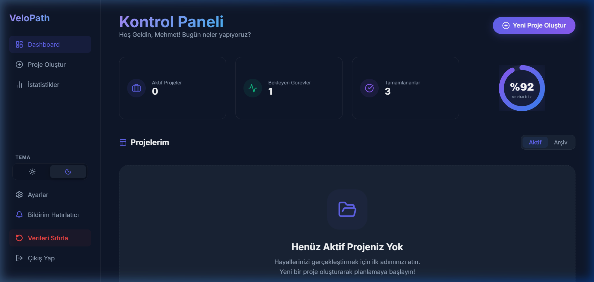
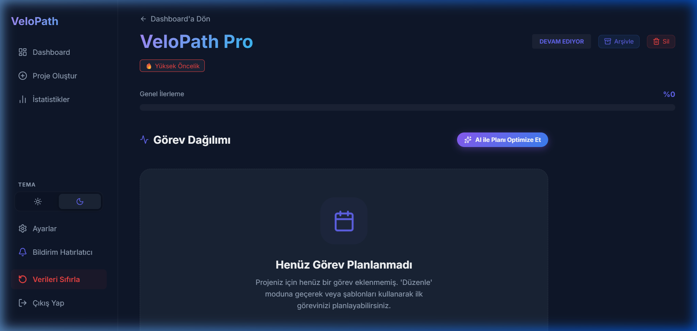
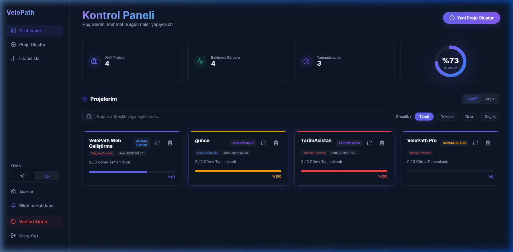
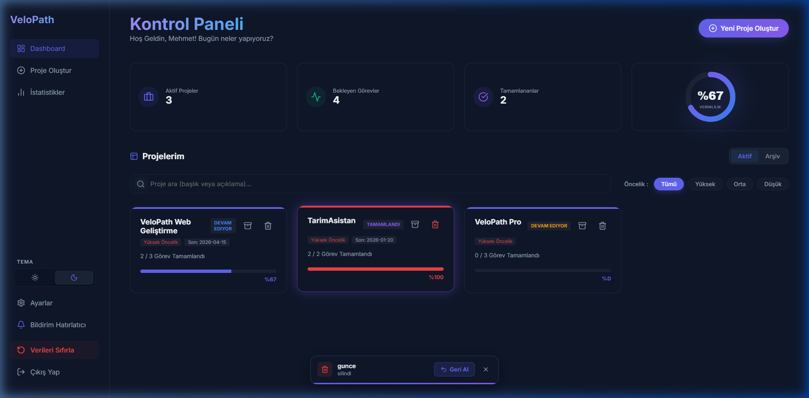
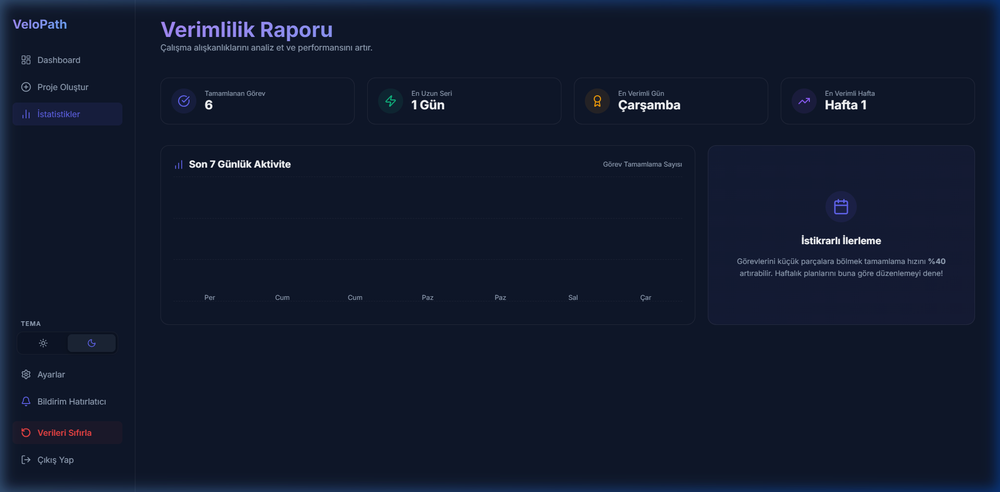

# VeloPath 🚀

**VeloPath**, kullanıcıların projelerini haftalık bazda akıllıca planlayabileceği, görevlerini sürükle-bırak yöntemiyle yönetebileceği ve ilerlemelerini dinamik olarak takip edebileceği **profesyonel** bir proje yönetim sistemidir.

---

## ✨ Ana Özellikler

VeloPath, en iyi modern kullanıcı deneyimini (UX) sunmak için Linear ve Vercel esintili tasarım trendleriyle inşa edilmiştir:

- 📊 **Haftalık Plan Görünümü:** Her projeyi haftalara bölün ve dairesel grafiklerle ilerlemeyi takip edin.
- 🏗️ **Sürükle-Bırak (Drag & Drop):** `@dnd-kit` ile görevlerinizi haftalar arası veya içinde pürüzsüzce sıralayın.
- 📜 **Görev Aktivite Geçmişi:** Her görevin ne zaman oluşturulduğu, tamamlandığı veya taşındığına dair detaylı zaman çizelgesi (Timeline) günlüğü.
- 📝 **Markdown Görev Notları:** Görevlerinize özel, zengin metin düzenleyicisi ile detaylı notlar ekleyin.
- 🔔 **Bildirim Hatırlatıcı:** Browser Notification API ile "Haftalık Görev Özeti" bildirimleri alın.
- 🚀 **Karşılama Sihirbazı (Onboarding):** Yeni kullanıcılar için 4 adımlı interaktif uygulama rehberi.
- 📈 **İstatistik ve Verimlilik Paneli:** Tamamlanan görev sayıları, en uzun çalışma seriniz (Streak) ve en verimli günlerinizin detaylı analizi.
- 🎨 **Boş Durum Tasarımı (Empty States):** Henüz veri yokken kullanıcıyı yönlendiren şık illüstrasyonlar ve aksiyon butonları.
- 🖼️ **Gelişmiş Arama ve Filtreleme:** Projelerinizi başlık veya açıklamaya göre arayın, öncelik bazlı (Yüksek, Orta, Düşük) anlık filtreleyin. Arama artık arşivlenmiş projeleri de kapsar!
- ↩️ **Geri Alma (Undo) Sistemi:** Yanlışlıkla silinen görev veya projeleri 5 saniyelik "Geri Al" bildirimi ile anında kurtarın.
- 🔗 **Görev Bağımlılıkları:** Görevler arası hiyerarşi ve kilit sistemi (Dependency) ile hata payını sıfırlayın.
- 📁 **Akıllı Proje Şablonları:** Tek tıkla Web, Mobil veya Full-Stack proje taslağınızı oluşturun.
- ☀️🌙 **Kalıcı Tema Sistemi:** MacOS tarzı modern arayüzle Aydınlık ve Karanlık mod arasında geçiş yapın.
- ⚡ **Hızlı Aksiyonlar:** Görevleri hızlıca silebilir, proje durumlarını anlık güncelleyebilirsiniz.
- 🔄 **Gelişmiş Veri Yönetimi:** "Verileri Sıfırla" butonu ile Local Storage senkronizasyonunu tek tıkla onarın.
- 💾 **Kalıcı Veri:** Tüm verileriniz `Local Storage` üzerinde güvenle saklanır.

---

## 📸 Ekran Görüntüleri

### 1. Kontrol Paneli (Dashboard)
Aktif projeler, istatistik kartları, genel verimlilik göstergesi ve renk kodlu proje kartları.


### 2. Karşılama Sihirbazı (Onboarding)
İlk girişte kullanıcıyı karşılayan 4 adımlı interaktif rehber — şeffaf "Atla" butonu tasarımıyla.


### 3. Boş Durum Tasarımı (Empty States)
Proje yokken veya arşiv boşken kullanıcıya yol gösteren şık illüstrasyon ekranları.


### 4. Proje Detay & Haftalık Plan
Görev yokken yönlendirici boş durum, varken haftalık gruplandırma ve ilerleme takibi.


### 5. İstatistik ve Verimlilik Raporu
Tamamlanan görevler, en uzun seri (streak), en verimli gün/hafta ve 7 günlük aktivite grafiği.


### 6. Gelişmiş Arama ve Öncelik Filtreleme
Kontrol panelinde projelerinizi anlık olarak filtreleyebileceğiniz, arşivdeki kayıtları da tarayan akıllı arama çubuğu ve öncelik butonları.


### 7. Geri Alma (Undo) Bildirimi
Kazara silinen verileri kurtarmak için 5 saniyelik dinamik ilerleme çubuğuna sahip interaktif bildirim sistemi.


### 8. İstatistikler & Verimlilik
Yenilenmiş stat kartları ve hatasız verimlilik çemberi grafiği ile detaylı performans analizi.


---

## 🛠️ Teknoloji Yığını

| Teknoloji | Kullanım |
|---|---|
| **React.js** | Frontend framework |
| **@dnd-kit** | Sürükle-bırak sistemi |
| **React Markdown** | Görev notu düzenleyici |
| **Lucide-React** | İkon kütüphanesi |
| **Vanilla CSS** | Modern Glassmorphism tasarım |
| **React Hooks** | State yönetimi |
| **Browser Notification API** | Bildirim sistemi |
| **localStorage** | Kalıcı veri depolama |

---

## 🚀 Kurulum ve Çalıştırma

Projeyi yerel ortamınızda çalıştırmak için şu adımları izleyin:

1. **Depoyu Klonlayın**
   ```bash
   git clone https://github.com/mehmeteminyilmaz/VeloPath.git
   cd VeloPath
   ```

2. **Bağımlılıkları Yükleyin**
   ```bash
   cd web
   npm install
   ```

3. **Uygulamayı Başlatın**
   ```bash
   npm start
   ```

---

## 📄 Lisans

Bu proje eğitim amaçlı geliştirilmektedir.