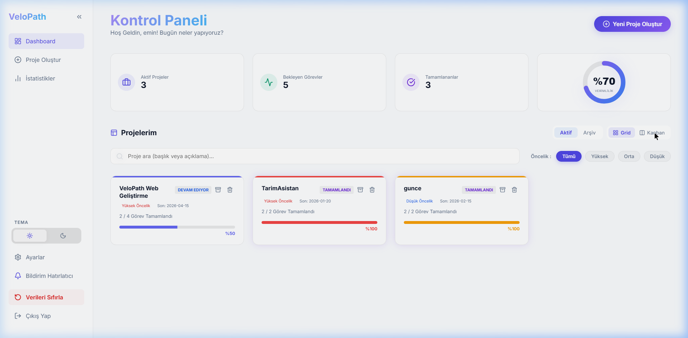
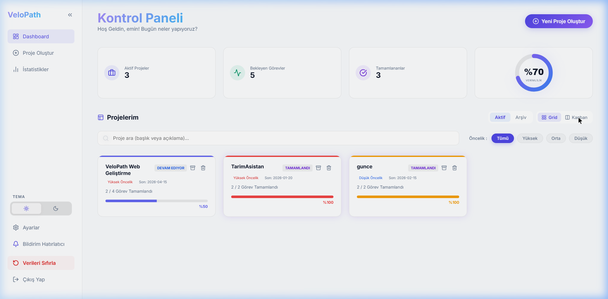
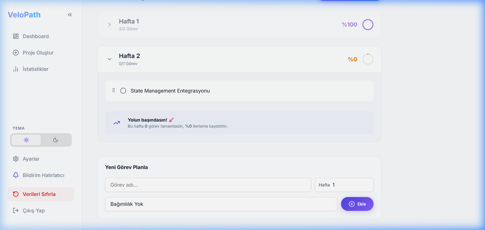
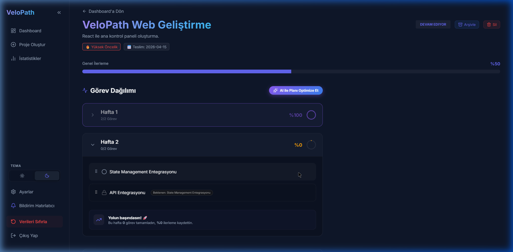
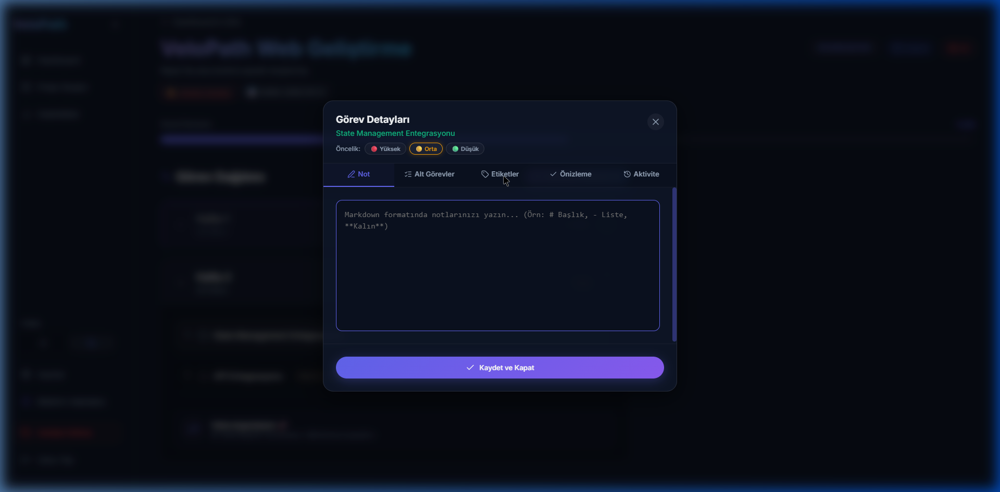
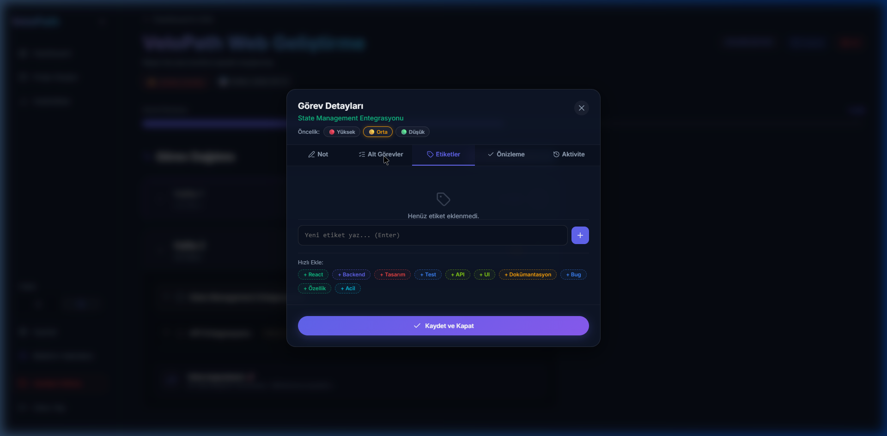

# VeloPath 🚀

<p align="center">
  <strong>Haftalık bazda akıllı proje planlama, Kanban panosu ve gelişmiş görev yönetimi platformu.</strong>
</p>

<p align="center">
  
  
  
  
</p>

---

## ✨ Özellikler

VeloPath, Linear ve Vercel esintili **Glassmorphism** tasarım diliyle inşa edilmiş kapsamlı bir proje yönetim SaaS platformudur.

### 🗂️ Proje Yönetimi

| Özellik | Açıklama |
|---|---|
| **🆕 Kanban Panosu** | Projelerinizi Yapılacak / Devam Ediyor / Tamamlandı sütunlarında görüntüleyin |
| **🆕 Grid / Kanban Toggle** | Dashboard'da tek tıkla görünüm değiştirin |
| **Proje Renk Kodlama** | Her projeye benzersiz renk atayın, kartlarda görsel şerit |
| **Arşivleme Sistemi** | Tamamlanan projeleri arşive alın, istediğinizde geri getirin |
| **Proje Şablonları** | Web, Mobil, Full-Stack tek tıkla hazır görev listesiyle başlayın |
| **🆕 Proje Notları** | Proje sayfasında Markdown destekli not defteri (düzenle + önizleme) |

### ✅ Görev Yönetimi

| Özellik | Açıklama |
|---|---|
| **Sürükle-Bırak** | `@dnd-kit` ile görevleri hafta sütunları arasında pürüzsüzce taşıyın |
| **🆕 Görev Öncelikleri** | Bireysel görev bazında 🔴 Yüksek / 🟡 Orta / 🟢 Düşük öncelik atayın |
| **🆕 Alt Görevler (Subtasks)** | Her göreve alt görev listesi ekleyin, ilerlemeyi mini bar ile izleyin |
| **🆕 Görev Etiketleri (Tags)** | Serbest etiket ekleyin (React, Backend, Tasarım...) + 10 hızlı öneri |
| **Görev Bağımlılıkları** | Görevler arası kilit sistemi; önce tamamlanması gereken görevi belirleyin |
| **Markdown Notlar** | Görevlere zengin metin notları ekleyin (düzenle + önizleme + aktivite) |
| **Aktivite Geçmişi** | Her görevin tam zaman çizelgesi (oluşturma, tamamlama, taşıma, not) |
| **Geri Alma (Undo)** | Silinen görev/projeyi 5 saniyelik toast bildirimiyle anında geri alın |

### 📊 Analiz & İstatistik

| Özellik | Açıklama |
|---|---|
| **Verimlilik Raporu** | Tamamlanan görevler, en uzun çalışma serisi (Streak), en verimli gün |
| **7 Günlük Aktivite Grafiği** | Son haftanın görev tamamlama dağılımı |
| **Genel İlerleme Halkası** | Tüm projelerin ortalamasını dairesel grafik ile görün |

### 🎨 Arayüz & Deneyim

| Özellik | Açıklama |
|---|---|
| **Dark / Light Tema** | Kalıcı tema tercihi, macOS tarzı geçiş |
| **Daraltılabilir Sidebar** | Çalışma alanınızı genişletmek için menüyü simge durumuna küçültün |
| **Onboarding Sihirbazı** | Yeni kullanıcılar için 4 adımlı interaktif rehber |
| **Premium Login (Midnight Glow)** | Aurora animasyonlu glassmorphism giriş ekranı |
| **Boş Durum Tasarımı** | Veri yokken şık illüstrasyonlar ve yönlendirici aksiyonlar |
| **Gelişmiş Arama & Filtre** | Başlık/açıklama arama + proje önceliği filtreleme |
| **Bildirim Sistemi** | Browser Notification API ile haftalık görev özeti |

---

## 📸 Ekran Görüntüleri

### 1. Kontrol Paneli — Grid Görünümü
Aktif projelerinizi başlık, öncelik, ilerleme çubuğu ve proje renkli şeritlerle görüntüleyin.



---

### 2. 🆕 Kontrol Paneli — Kanban Panosu
Projelerinizi otomatik sınıflandırılmış Kanban sütunlarında (📋 Yapılacak / ⚡ Devam Ediyor / ✅ Tamamlandı) izleyin.



---

### 3. Proje Detayları & Haftalık Plan
Her projenin haftalık görev dağılımını dairesel ilerleme grafikleri, drag-drop sıralama ve bağımlılık kilitleriyle yönetin.



---

### 4. Görev Detay Modalı — Not Düzenleyici
Görevlere Markdown not ekleyin; editör, önizleme ve aktivite geçmişi sekmeleriyle zengin içerik yönetimi.



---

### 5. 🆕 Görev Etiketleri (Tags)
Her göreve serbest etiket ekleyin; 10 hazır öneri, otomatik renk ataması ve görev kartında mini chip gösterimi.



---

### 6. 🆕 Alt Görevler (Subtasks)
Ana görevin altına alt görev listesi ekleyin, tamamlayın ve progress bar ile anlık ilerlemeyi takip edin.



---

### 7. 🆕 Proje Notları
Proje sayfasında aç/kapat toggle'lı markdown not defteri — toplantı kararları, referanslar ve açıklamalar için.


---

## 🛠️ Teknoloji Yığını

| Teknoloji | Kullanım |
|---|---|
| **React.js 18** | Frontend framework |
| **React Router v6** | Sayfa yönlendirme |
| **@dnd-kit** | Sürükle-bırak sistemi |
| **React Markdown** | Görev notu + proje notu düzenleyici |
| **Lucide-React** | İkon kütüphanesi |
| **Vanilla CSS** | Glassmorphism & CSS Custom Properties |
| **React Hooks** | State & efekt yönetimi |
| **Browser Notification API** | Bildirim sistemi |
| **localStorage** | Tüm verilerin kalıcı depolanması |

---

## 🚀 Kurulum ve Çalıştırma

```bash
# 1. Repoyu klonlayın
git clone https://github.com/mehmeteminyilmaz/VeloPath.git
cd VeloPath

# 2. Bağımlılıkları yükleyin
cd web
npm install

# 3. Geliştirme sunucusunu başlatın
npm start
```

Uygulama `http://localhost:3000` adresinde açılır.

---

## 📁 Proje Yapısı

```
VeloPath/
├── web/
│   └── src/
│       ├── App.js                # Global state, route'lar ve tüm handler'lar
│       ├── components/
│       │   ├── WeeklyPlan.js     # Drag-drop haftalık plan + etiket/öncelik gösterimi
│       │   ├── TaskNoteModal.js  # Not / Alt Görevler / Etiketler / Aktivite modalı
│       │   ├── Sidebar.js        # Daraltılabilir navigasyon paneli
│       │   ├── ProgressChart.js  # Dairesel ilerleme grafiği
│       │   ├── UndoToast.js      # Silme geri alma bildirimi
│       │   ├── Onboarding.js     # 4 adımlı kullanıcı sihirbazı
│       │   └── EmptyState.js     # Boş durum bileşeni
│       ├── pages/
│       │   ├── Dashboard.js      # Grid & Kanban görünümü
│       │   ├── ProjectDetails.js # Proje detayı + proje notları
│       │   ├── CreateProject.js  # Yeni proje oluşturma + şablonlar
│       │   ├── Stats.js          # Verimlilik raporu
│       │   └── Login.js          # Giriş ekranı
│       └── styles/
│           └── App.css           # Tüm stil sistemi (dark/light tema)
├── docs/
│   └── assets/                   # README ekran görüntüleri
└── README.md
```

---

## 🗺️ Yol Haritası

- [x] Haftalık plan & drag-drop
- [x] Görev bağımlılıkları & kilit sistemi
- [x] Proje şablonları
- [x] Arşivleme sistemi
- [x] Markdown notlar & aktivite geçmişi
- [x] Geri alma (Undo) sistemi
- [x] Arama & öncelik filtreleme
- [x] **Kanban panosu görünümü** 🆕
- [x] **Görev etiketleri (Tags)** 🆕
- [x] **Alt görevler (Subtasks)** 🆕
- [x] **Görev öncelikleri (bireysel)** 🆕
- [x] **Proje notları (Markdown)** 🆕
- [ ] Takvim görünümü
- [ ] Görev zamanlayıcı (Pomodoro)
- [ ] Gerçek backend (Firebase / Supabase)
- [ ] Mobil uygulama (Flutter)

---

## 📄 Lisans

Bu proje eğitim ve portfolyo amaçlı geliştirilmektedir.

---

<p align="center">Made with ❤️ by <a href="https://github.com/mehmeteminyilmaz">mehmeteminyilmaz</a></p>
