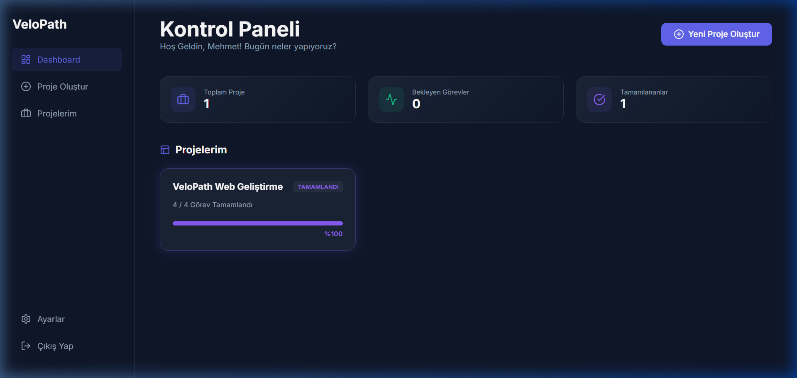

# VeloPath 🚀


**VeloPath**, kullanıcıların projelerini akıllıca planlayabileceği, görevlerini yönetebileceği ve ilerlemelerini dinamik olarak takip edebileceği **AI destekli** bir proje yönetim sistemidir.

---

## ✨ Özellikler (Hafta 4)

VeloPath, modern bir kullanıcı deneyimi sunmak için tasarlanmıştır:

- **📊 Dinamik Dashboard:** Tüm projelerinizin genel durumunu ve istatistiklerini (Toplam Proje, Bekleyen Görevler vb.) tek bir ekranda görün.
- **🎨 Akıllı İlerleme Renkleri:** Proje ilerlemesine göre renk değiştiren progress bar'lar:
  - 🟠 **%0 - %30:** Başlangıç
  - 🔵 **%31 - %70:** İlerliyor
  - 🟢 **%71 - %100:** Final Yakın / Tamamlandı (Glow Efekti)
- **🌑 Premium Dark Mode:** Göz yormayan, "Glassmorphism" efektli modern ve profesyonel arayüz.
- **📱 Responsive Navigasyon:** Sayfalar arası hızlı ve kolay geçiş sağlayan Sidebar menüsü.
- **🛠️ Görev Yönetimi:** Proje detaylarında anlık görev ekleme, silme ve tamamlama takibi.

---

## 📸 Ekran Görüntüleri

### Kontrol Paneli (Dashboard)


---

## 🛠️ Teknoloji Yığını

- **Frontend:** React.js
- **Routing:** React Router Dom
- **İkonlar:** Lucide-React
- **Tasarım:** Vanilla CSS (Custom Glassmorphism)
- **State Yönetimi:** React Hooks (useState, useEffect)

---

## 🚀 Kurulum ve Çalıştırma

Projeyi yerel ortamınızda çalıştırmak için şu adımları izleyin:

### 1. Depoyu Klonlayın
```bash
git clone https://github.com/mehmeteminyilmaz/VeloPath.git
cd VeloPath
```

### 2. Bağımlılıkları Yükleyin
```bash
cd web
npm install
```

### 3. Uygulamayı Başlatın
```bash
npm start
```
Uygulama varsayılan olarak `http://localhost:3000` adresinde çalışacaktır.

---

## 📅 Proje Yol Haritası

Projenin 10 haftalık gelişim planına ve dökümantasyonuna [docs/project-roadmap.md](./docs/project-roadmap.md) dosyasından ulaşabilirsiniz.

---

## 📂 Klasör Yapısı

```text
VeloPath
 ├── web      # React Frontend Uygulaması
 ├── mobile   # React Native Mobil Uygulama (Gelecek Aşama)
 ├── backend  # Node.js API (Gelecek Aşama)
 ├── docs     # Proje Dokümantasyonu ve Varlıklar
 └── README.md
```

---

## 📄 Lisans

Bu proje eğitim amaçlı geliştirilmektedir.