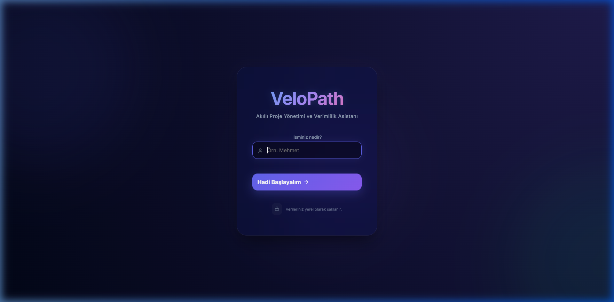
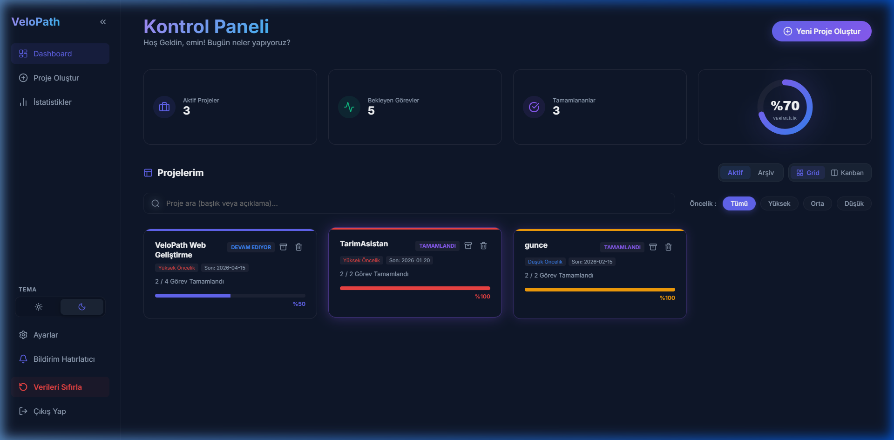
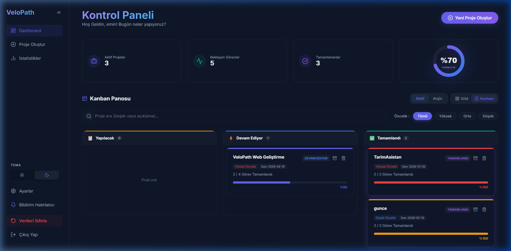
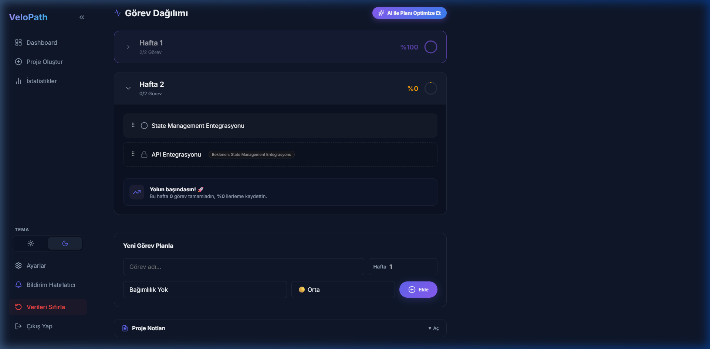
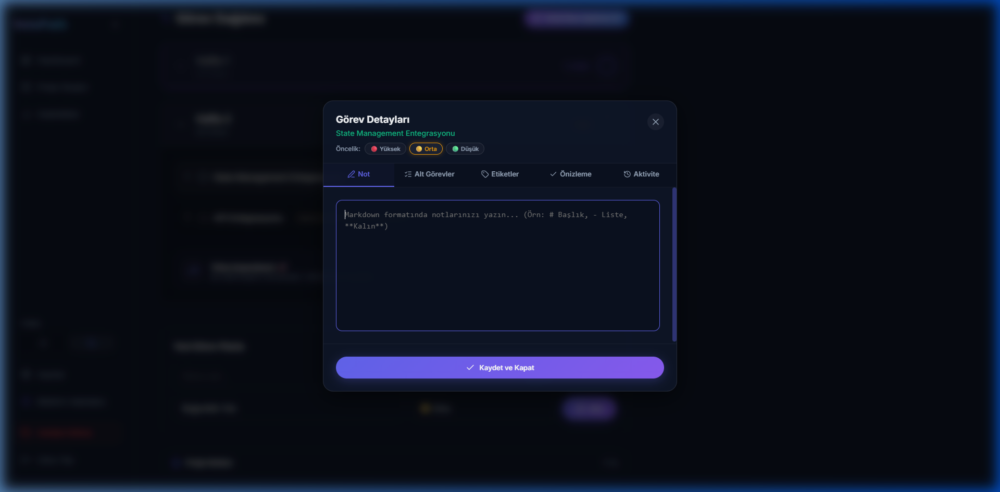
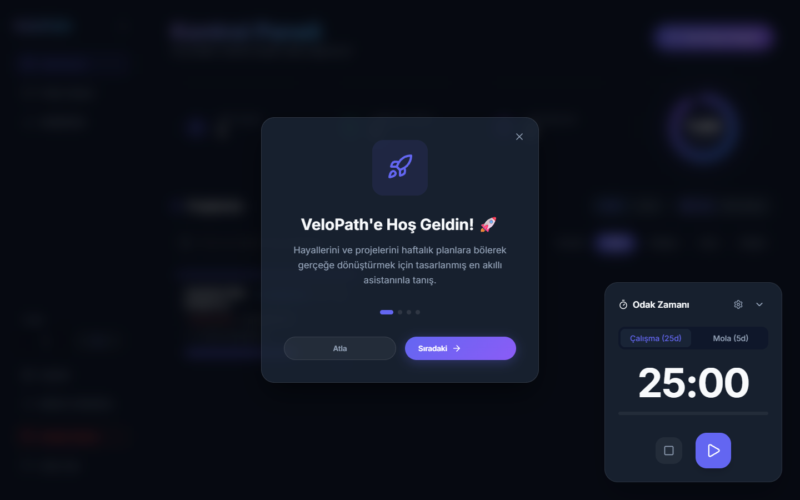

<div align="center">

# VeloPath 🚀
**Karmaşık projeleri basitleştirin. Haftalık planlar ve modern Kanban panosuyla kendi ritminizde çalışın.**

[](https://react.dev)
[](https://dndkit.com)
[](https://github.com/mehmeteminyilmaz/VeloPath)
[](https://github.com/mehmeteminyilmaz/VeloPath)

</div>

---

## 🎬 Genel Bakış

VeloPath, proje yönetimini daha kolay ve görsel hale getirmek için geliştirdiğim bir web uygulaması. Haftalık plan, Kanban panosu, etiketler, alt görevler gibi ihtiyaç duyduğum özellikleri bir araya getirip modern bir arayüzle sunmayı istedim. Hâlâ gelişmeye devam ediyor.

### ✨ Ana Özellikler

- **📅 Haftalık Plan:** Projelerinizi haftalara bölün ve dairesel grafiklerle ilerlemeyi takip edin.
- **🖱️ Sürükle-Bırak (Drag & Drop):** `@dnd-kit` ile görevlerinizi haftalar arası veya içinde pürüzsüzce sıralayın.
- **⏳ Görev Aktivite Geçmişi:** Her görevin ne zaman oluşturulduğu, tamamlandığı veya taşındığına dair detaylı zaman çizelgesi (Timeline) günlüğü.
- **📝 Markdown Görev Notları:** Görevlerinize özel, zengin metin düzenleyicisi ile detaylı notlar ekleyin.
- **🔔 Bildirim Hatırlatıcı:** Browser Notification API ile "Haftalık Görev Özeti" bildirimleri alın.
- **🚀 Karşılama Sihirbazı (Onboarding):** Yeni kullanıcılar için 4 adımlı interaktif uygulama rehberi.
- **📈 İstatistik ve Verimlilik Paneli:** Tamamlanan görev sayıları, en uzun çalışma seriniz (Streak) ve en verimli günlerinizin detaylı analizi.
- **🎨 Boş Durum Tasarımı (Empty States):** Henüz veri yokken kullanıcıyı yönlendiren şık illüstrasyonlar ve aksiyon butonları.
- **🔗 Görev Bağımlılıkları:** Görevler arası hiyerarşi ve kilit sistemi (Dependency) ile hata payını sıfırlayın.
- **📁 Akıllı Proje Şablonları:** Tek tıkla Web, Mobil veya Full-Stack proje taslağınızı oluşturun.
- **🌓 Kalıcı Tema Sistemi:** MacOS tarzı modern arayüzle Aydınlık ve Karanlık mod arasında geçiş yapın.
- **⚡ Hızlı Aksiyonlar:** Görevleri hızlıca silebilir, proje durumlarını anlık güncelleyebilirsiniz.
- **🔄 Gelişmiş Veri Yönetimi:** "Verileri Sıfırla" butonu ile Local Storage senkronizasyonunu tek tıkla onarın.
- **💾 Kalıcı Veri:** Tüm verileriniz `Local Storage` üzerinde güvenle saklanır.
- **⏱️ Pomodoro Sayacı:** Odaklanmanızı artırmak için her yerden erişilebilen yüzen Pomodoro aracı.

---

### 🔐 Premium Giriş Deneyimi

Aurora animasyonlu, cam morfoloji (glassmorphism) etkili **Midnight Glow** giriş ekranı. Kişiselleştirilmiş hoş geldin deneyimi ve kalıcı oturum yönetimi.



---

### 📊 Akıllı Kontrol Paneli

Tüm projelerinizi tek bir panelden yönetin. İstatistik kartları, genel ilerleme halkası, anlık arama ve öncelik filtreleme ile tam bir komuta merkezi.



---

### 🗂️ Kanban Panosu

Bazen listeye bakmak yerine büyük resmi görmek istersiniz. Kanban modunda projeleriniz ilerleme durumuna göre **Yapılacak → Devam Ediyor → Tamamlandı** sütunlarına otomatik olarak ayrılır.



---

### 📅 Haftalık Görev Planlama

Projenizi haftalara bölün, görevleri **sürükle-bırak** ile yeniden sıralayın, haftalar arası taşıyın. Bağımlılık kilitleri, mini ilerleme grafikleri ve anlık etiket/öncelik rozetleriyle tam kontrol.



---

### ✅ Görev Yönetim Merkezi

Her göreve tıklayın; **markdown not editörü**, **alt görevler**, **etiketler**, **öncelik seçici** ve **aktivite geçmişi** sekmeleriyle derinlemesine yönetin.



---

### 📈 Verimlilik ve İstatistik Raporu

7 günlük aktivite grafiği, en uzun çalışma seriniz (streak), en verimli gününüz ve tamamlanan görev analizleriyle çalışma alışkanlıklarınızı keşfedin.


---

### ⏱️ Pomodoro ve Zaman Yönetimi

Odaklanmanızı artırmak için her yerden erişilebilen yüzen (floating) Pomodoro sayacı. Özelleştirilebilir çalışma ve mola süreleri ile otomatik sistem bildirimleri.



---

## ✨ Özellik Listesi

<details>
<summary><strong>🗂️ Proje Yönetimi</strong></summary>

| Özellik | Açıklama |
|---|---|
| **Kanban Panosu** | İlerlemeye göre otomatik sütun sınıflandırması |
| **Grid / Kanban Toggle** | Tek tıkla görünüm değiştirme |
| **Proje Renk Kodlama** | Her projeye özel renk ve görsel şerit |
| **Arşivleme** | Projeleri arşivle, istediğinde geri getir |
| **Proje Şablonları** | Web, Mobil, Full-Stack hazır görev listeleri |
| **Proje Notları** | Markdown note defteri (düzenle + önizleme) |

</details>

<details>
<summary><strong>✅ Görev Yönetimi</strong></summary>

| Özellik | Açıklama |
|---|---|
| **Sürükle-Bırak** | `@dnd-kit` ile haftalar arası pürüzsüz taşıma |
| **Görev Öncelikleri** | Bireysel 🔴 Yüksek / 🟡 Orta / 🟢 Düşük |
| **Alt Görevler** | Alt görev listesi + ilerleme barı + mini gösterim |
| **Görev Etiketleri** | Serbest etiket + 10 hızlı öneri + renkli chip'ler |
| **Bağımlılık Kilitleri** | Önce tamamlanması gereken görevi belirle |
| **Markdown Notlar** | Zengin metin; düzenle + önizle + aktivite geçmişi |
| **Geri Alma (Undo)** | 5 saniyelik toast ile silme geri alma |

</details>

<details>
<summary><strong>🎨 Arayüz & Deneyim</strong></summary>

| Özellik | Açıklama |
|---|---|
| **Dark / Light Tema** | Kalıcı macOS tarzı tema geçişi |
| **Daraltılabilir Sidebar** | Çalışma alanını genişlet, odaklanmış mod |
| **Onboarding Sihirbazı** | 4 adımlı interaktif kullanıcı rehberi |
| **Boş Durum Tasarımı** | Veri yokken şık yönlendirici ekranlar |
| **Gelişmiş Arama & Filtre** | Başlık/açıklama arama + öncelik filtresi |
| **Bildirim Sistemi** | Browser Notification API ile hatırlatmalar |
| **Pomodoro Sayacı** | Global, özelleştirilebilir odaklanma aracı |

</details>

---

## 🛠️ Teknoloji Yığını

| Teknoloji | Kullanım |
|---|---|
| **React.js 18** | Frontend framework |
| **Node.js & Express** | REST API & Backend sunucusu |
| **MongoDB (Atlas)** | Bulut tabanlı kalıcı veritabanı |
| **React Router v6** | Sayfa yönlendirme |
| **@dnd-kit** | Sürükle-bırak sistemi |
| **React Markdown** | Görev notu + proje notu editörü |
| **Axios** | Frontend-Backend arası veri iletişimi |
| **Vanilla CSS** | Glassmorphism & CSS Custom Properties |
| **localStorage** | Kalıcı veri depolama |
| **Browser Notification API** | Bildirim sistemi |

---

## 🚀 Kurulum

```bash
# Repoyu klonlayın
git clone https://github.com/mehmeteminyilmaz/VeloPath.git
cd VeloPath/web

# Bağımlılıkları yükleyin
npm install

# Geliştirme sunucusunu başlatın
npm start
```

➡️ `http://localhost:3000` adresinde açılır.


