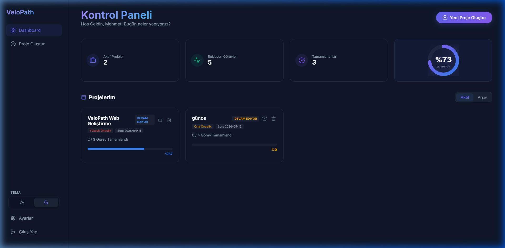
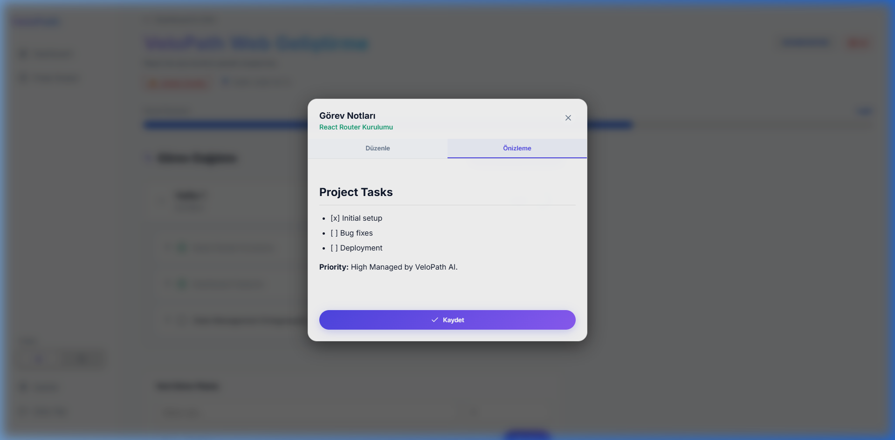
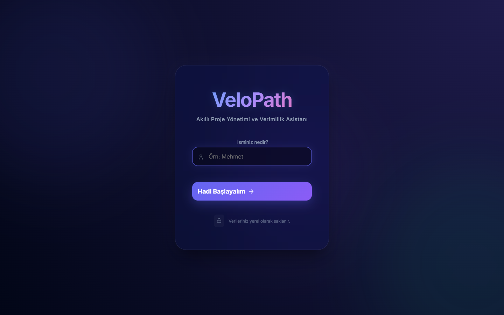
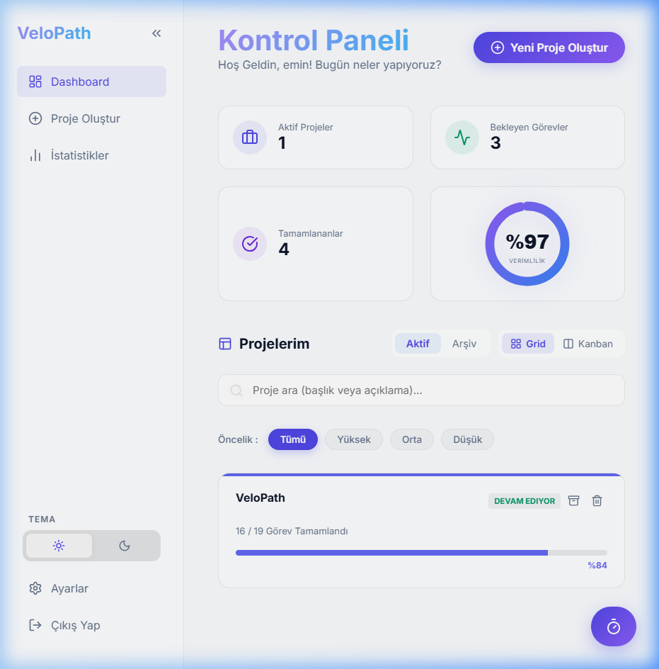
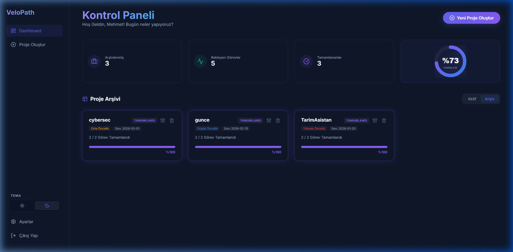
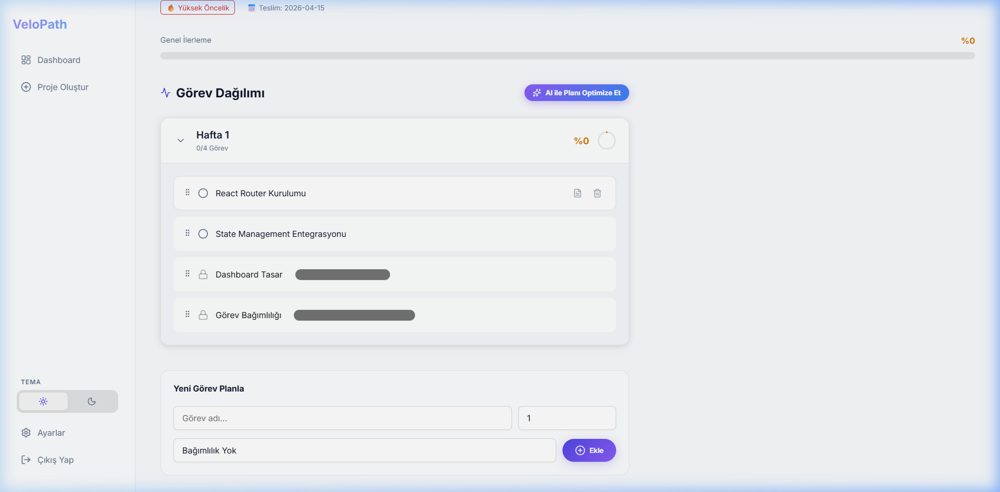
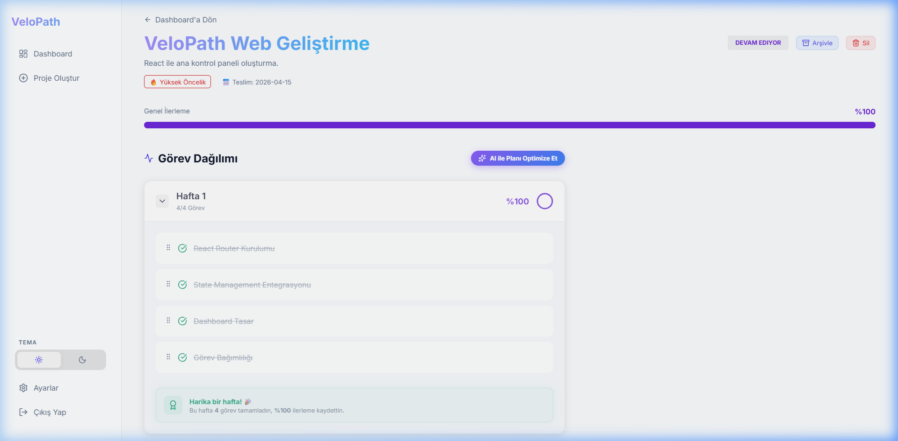
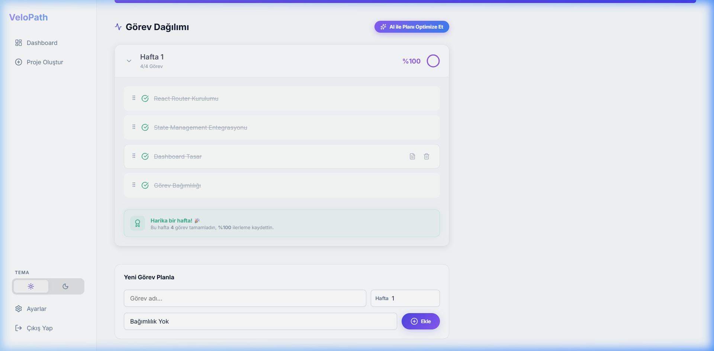

# VeloPath 🚀

**VeloPath**, kullanıcıların projelerini haftalık bazda akıllıca planlayabileceği, görevlerini sürükle-bırak yöntemiyle yönetebileceği ve ilerlemelerini dinamik olarak takip edebileceği **profesyonel** bir proje yönetim sistemidir.

---

## ✨ Ana Özellikler

VeloPath, en iyi modern kullanıcı deneyimini (UX) sunmak için Linear ve Vercel esintili tasarım trendleriyle inşa edilmiştir:

- 📊 **Haftalık Plan Görünümü:** Her projeyi haftalara bölün ve dairesel grafiklerle ilerlemeyi takip edin.
- 🏗️ **Sürükle-Bırak (Drag & Drop):** `@dnd-kit` ile görevlerinizi haftalar arası veya içinde pürüzsüzce sıralayın.
- 📝 **Markdown Görev Notları:** Görevlerinize özel, zengin metin düzenleyicisi ile detaylı notlar ekleyin.
- 🔗 **Görev Bağımlılıkları:** Görevler arası hiyerarşi ve kilit sistemi (Dependency) ile hata payını sıfırlayın.
- 📁 **Akıllı Proje Şablonları:** Tek tıkla Web, Mobil veya Full-Stack proje taslağınızı oluşturun.
- ☀️🌙 **Kalıcı Tema Sistemi:** MacOS tarzı modern arayüzle Aydınlık ve Karanlık mod arasında geçiş yapın.
- ⚡ **Hızlı Aksiyonlar:** Görevleri hızlıca silebilir, proje durumlarını anlık güncelleyebilirsiniz.
- 📦 **Proje Arşivleme:** Tamamlanan projeleri arşive taşıyarak çalışma alanınızı düzenli tutun.
- 💾 **Kalıcı Veri:** Tüm verileriniz `Local Storage` üzerinde güvenle saklanır.

---

## 📸 Ekran Görüntüleri

### 1. Haftalık Plan ve Organizasyon
Görevlerin haftalara dağılımı ve sürükle-bırak sistemi.


### 2. Görev Detayları ve Markdown Notlar
Not editörü ve görev bağımlılıklarının yönetim alanı.


### 3. Yeni Proje ve Şablon Sistemi
Önizleme destekli, hızlı proje oluşturma formu.


### 4. Aydınlık Tema Desteği
Göz yormayan, modern ve ferah yeni aydınlık tema seçeneği.


### 5. Proje Arşivi
Tamamlanan projelerin toplandığı, düzenli arşiv alanı.


### 6. Görev Bağımlılığı ve Kilit Sistemi
"Şu bitmeden bu başlayamaz" mantığıyla çalışan akıllı kilit sistemi.


### 7. Haftalık İlerleme Özeti
Her hafta sonunda başarı durumunu özetleyen akıllı motivasyon kartları.


### 8. Gelişmiş Arayüz Deneyimi
Hafta bazlı görev girişi ve temalar arası tam uyumluluk (Aydınlık/Karanlık).


---

## 🛠️ Teknoloji Yığını

- **Frontend:** React.js
- **Sürükle-Bırak:** @dnd-kit
- **Metin Düzenleme:** React Markdown
- **İkonlar:** Lucide-React
- **Tasarım:** Vanilla CSS (Modern Glassmorphism)
- **State Yönetimi:** React Hooks

---

## 🚀 Kurulum ve Çalıştırma

Projeyi yerel ortamınızda çalıştırmak için şu adımları izleyin:

1. **Depoyu Klonlayın**
   ```bash
   git clone https://github.com/mehmeteminyilmaz/VeloPath.git
   cd VeloPath
   ```

2. **Bağımlılıkları Yükleyin**
   ```bash
   cd web
   npm install
   ```

3. **Uygulamayı Başlatın**
   ```bash
   npm start
   ```

---

## 📄 Lisans

Bu proje eğitim amaçlı geliştirilmektedir.