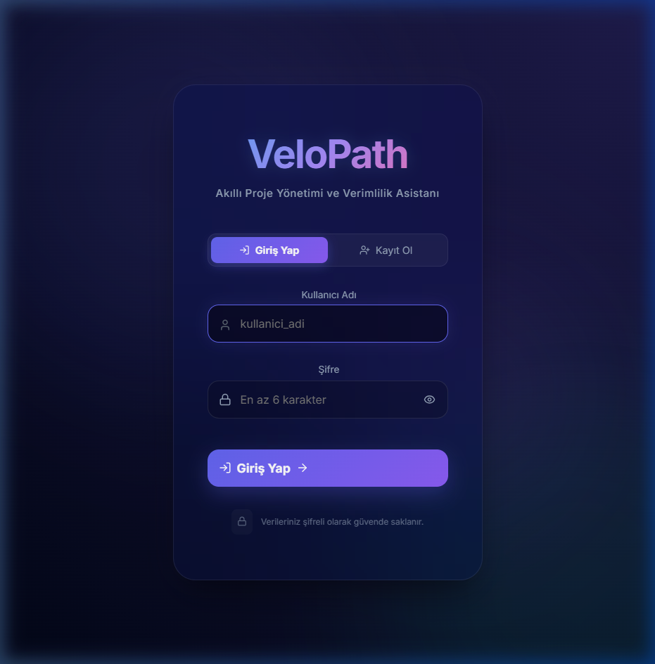
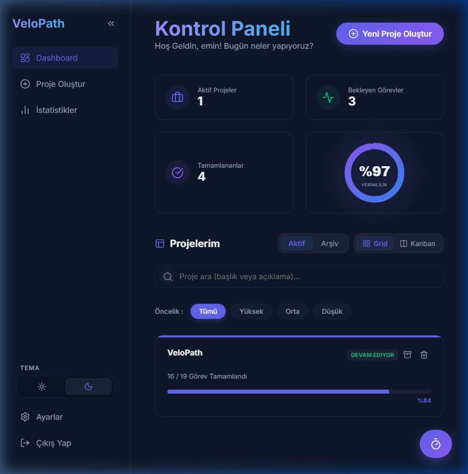
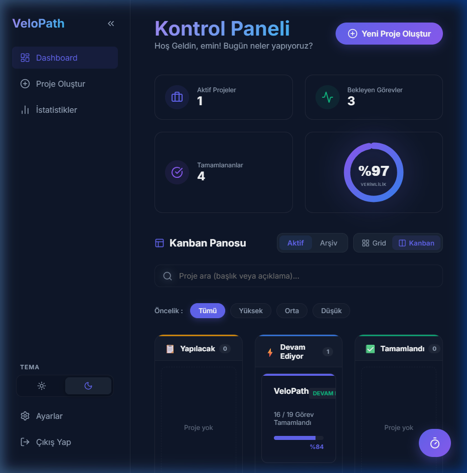
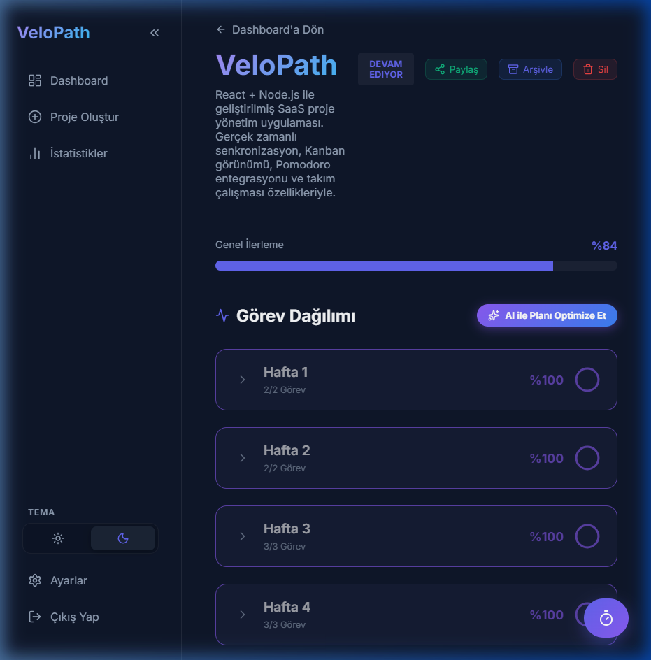
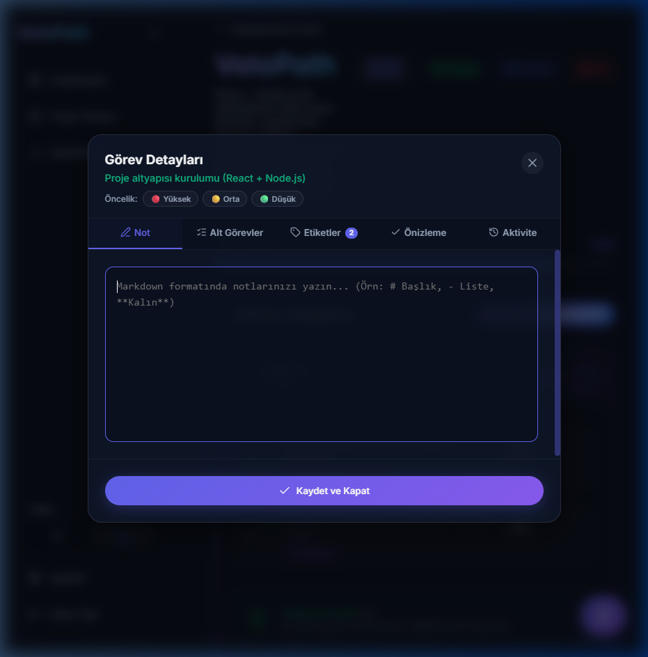
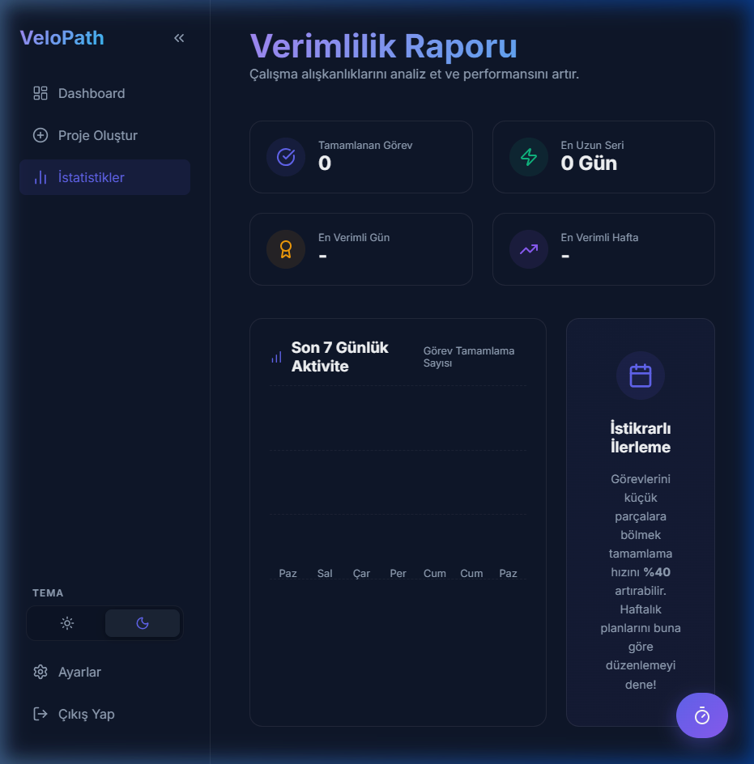
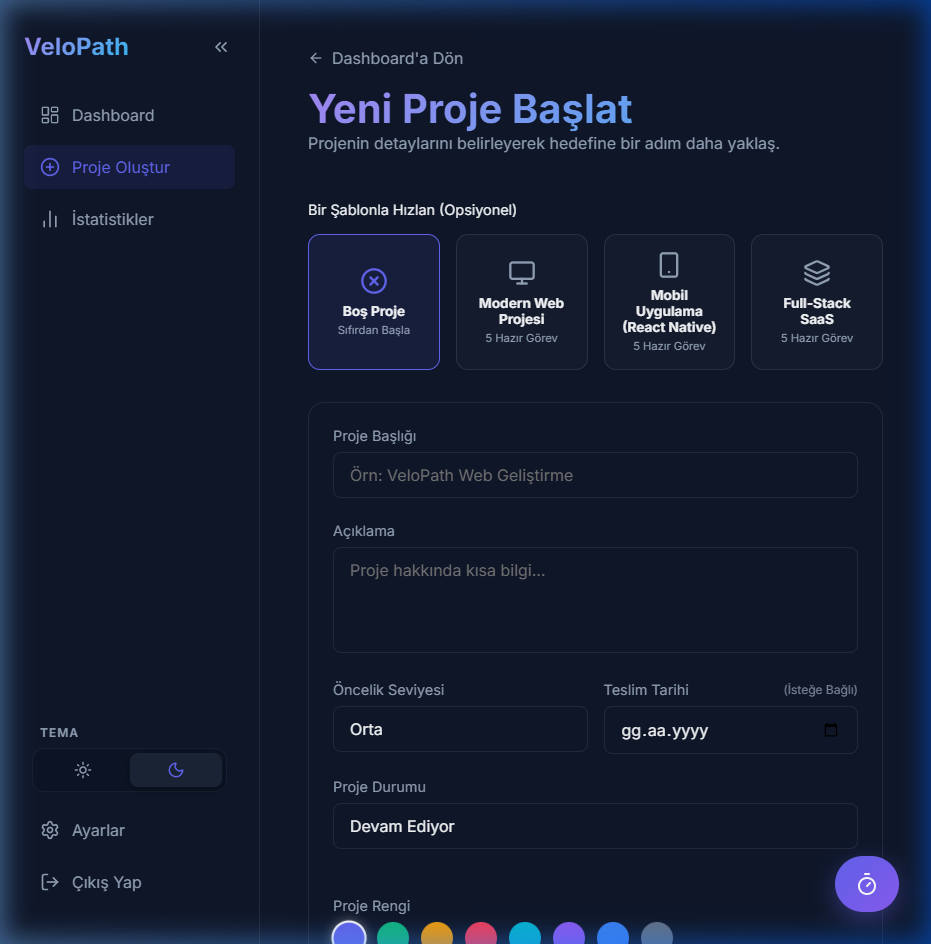
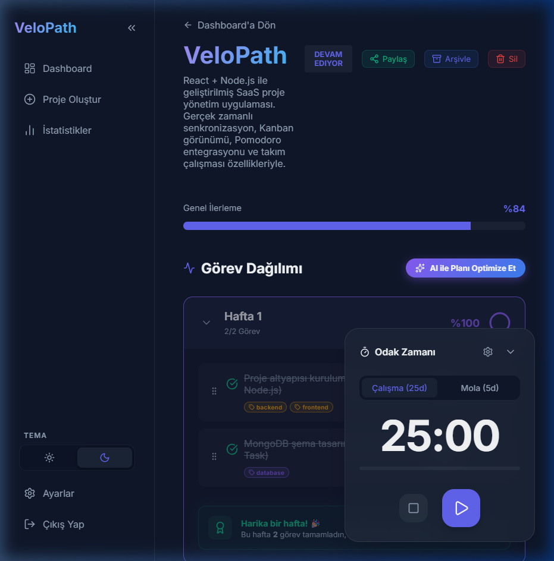

<div align="center">

# VeloPath 🚀
**Karmaşık projeleri basitleştirin. Haftalık planlar ve modern Kanban panosuyla kendi ritminizde çalışın.**

[](https://react.dev)
[](https://dndkit.com)
[](https://github.com/mehmeteminyilmaz/VeloPath)
[](https://github.com/mehmeteminyilmaz/VeloPath)

</div>

---

## 🎬 Genel Bakış

VeloPath, modern profesyoneller ve ekipler için tasarlanmış, yüksek performanslı bir proje yönetim platformudur. Geleneksel karmaşık araçların aksine; **Haftalık Planlama**, **Gerçek Zamanlı Senkronizasyon** ve **Kişiselleştirilmiş Verimlilik Analizi** özelliklerini tek bir cam morfoloji (glassmorphism) temalı arayüzde birleştirir. Tamamen bulut tabanlı mimarisi (MongoDB) ve canlı iş birliği (Socket.io) desteği ile projelerinizi her yerden ve her cihazdan eşzamanlı olarak yönetmenizi sağlar.

### ✨ Ana Özellikler

- **⚡ Gerçek Zamanlı Senkronizasyon:** `Socket.io` ile cihazlar arası anlık veri eşitleme (Mobil & Web tam uyum).
- **🤝 Takım Çalışması:** Projelerinizi diğer kullanıcılarla güvenli bir şekilde paylaşın ve aynı pano üzerinde eşzamanlı çalışın.
- **☁️ Modern Bulut Mimarisi:** MongoDB altyapısı ile sınırsız depolama ve gelişmiş kullanıcı izolasyonu.
- **📅 Haftalık Planlama:** Projelerinizi yönetilebilir haftalık dilimlere bölün ve dairesel grafiklerle ilerlemeyi takip edin.
- **🖱️ Akıllı Sürükle-Bırak:** `@dnd-kit` ile görevlerinizi haftalar arası veya içinde pürüzsüzce sıralayın.
- **⏳ Görev Aktivite Geçmişi:** Her görevin oluşturulma, tamamlanma veya taşınma detaylarını içeren zaman çizelgesi (Timeline) günlüğü.
- **📝 Markdown Desteği:** Hem proje hem de görev düzeyinde zengin metin düzenleyicisi ile profesyonel notlar tutun.
- **📈 Verimlilik Analitiği:** 7 günlük aktivite grafikleri, çalışma serileri (streaks) ve en verimli gün analizleri.
- **🌓 MacOS Tarzı Tema:** MacOS estetiğine sahip, özel optimize edilmiş Aydınlık ve Karanlık mod desteği.
- **⏱️ Entegre Pomodoro:** Odaklanmanızı artırmak için her sayfadan erişilebilen yüzen Pomodoro zamanlayıcısı.

---

### 🔐 Güvenli ve Modern Giriş Deneyimi

Bcrypt ile şifrelenmiş güvenli oturum yönetimi ve Aurora animasyonlu, premium **Midnight Glow** giriş ekranı.



---

### 📊 Akıllı Kontrol Paneli (Dashboard)

Tüm projelerinizi, bekleyen görevlerinizi ve genel verimliliğinizi tek bir bakışta görün. Gelişmiş arama ve öncelik filtreleme ile projelerinizi saniyeler içinde bulun.



---

### 🗂️ Kanban Panosu Görünümü

Projelerinizi görsel bir akış şemasına dönüştürün. Görevler otomatik olarak **Yapılacak → Devam Ediyor → Tamamlandı** sütunlarına ayrılır.



---

### ☀️ Aydınlık Tema (Light Mode)

VeloPath, ferah ve modern bir görünüm isteyenler için özel olarak tasarlanmış Light Mode desteği sunar. Tüm renk paleti ve gölgeler göz yormayacak şekilde optimize edilmiştir.


---

### 📅 Proje Detayları ve Haftalık Plan

Haftalara yayılmış görev listeleri, bağımlılık kilitleri ve mini ilerleme göstergeleri ile projenizin her aşamasını kontrol altında tutun.



---

### ✅ Gelişmiş Görev Yönetimi

Alt görevler, etiketler, öncelik seviyeleri ve markdown notları ile her görevi detaylıca yapılandırın.



---

### 📈 Verimlilik ve İstatistik Raporu

Çalışma alışkanlıklarınızı veriye dayalı grafiklerle analiz edin ve performansınızı artırın.



---

### ➕ Şablonlarla Hızlı Başlangıç

Web, Mobil veya Full-Stack şablonlarını kullanarak projenizi saniyeler içinde önceden tanımlanmış görevlerle başlatın.



---

### ⏱️ Odaklanma: Pomodoro Zamanlayıcısı

Özelleştirilebilir çalışma/mola süreleri ve sistem bildirimleri ile dikkatinizi koruyun.



---

## ✨ Özellik Listesi

<details>
<summary><strong>🗂️ Proje Yönetimi</strong></summary>

| Özellik | Açıklama |
|---|---|
| **Kanban Panosu** | İlerlemeye göre otomatik sütun sınıflandırması |
| **Grid / Kanban Toggle** | Tek tıkla görünüm değiştirme |
| **Proje Renk Kodlama** | Her projeye özel renk ve görsel şerit |
| **Arşivleme** | Projeleri arşivle, istediğinde geri getir |
| **Proje Paylaşımı (Collaboration)** | Diğer kullanıcıları projenize davet edin |
| **Gerçek Zamanlı Senkronizasyon** | Cihazlar arası Socket.io ile anında eşzamanlılık |
| **Proje Şablonları** | Web, Mobil, Full-Stack hazır görev listeleri |
| **Proje Notları** | Markdown note defteri (düzenle + önizleme) |

</details>

<details>
<summary><strong>✅ Görev Yönetimi</strong></summary>

| Özellik | Açıklama |
|---|---|
| **Sürükle-Bırak** | `@dnd-kit` ile haftalar arası pürüzsüz taşıma |
| **Görev Öncelikleri** | Bireysel 🔴 Yüksek / 🟡 Orta / 🟢 Düşük |
| **Alt Görevler** | Alt görev listesi + ilerleme barı + mini gösterim |
| **Görev Etiketleri** | Serbest etiket + 10 hızlı öneri + renkli chip'ler |
| **Bağımlılık Kilitleri** | Önce tamamlanması gereken görevi belirle |
| **Markdown Notlar** | Zengin metin; düzenle + önizle + aktivite geçmişi |
| **Geri Alma (Undo)** | 5 saniyelik toast ile silme geri alma |

</details>

<details>
<summary><strong>🎨 Arayüz & Deneyim</strong></summary>

| Özellik | Açıklama |
|---|---|
| **Dark / Light Tema** | Kalıcı macOS tarzı tema geçişi |
| **Daraltılabilir Sidebar** | Çalışma alanını genişlet, odaklanmış mod |
| **Onboarding Sihirbazı** | 4 adımlı interaktif kullanıcı rehberi |
| **Boş Durum Tasarımı** | Veri yokken şık yönlendirici ekranlar |
| **Gelişmiş Arama & Filtre** | Başlık/açıklama arama + öncelik filtresi |
| **Bildirim Sistemi** | Browser Notification API ile hatırlatmalar |
| **Pomodoro Sayacı** | Global, özelleştirilebilir odaklanma aracı |

</details>

---

## 🛠️ Teknoloji Yığını

| Teknoloji | Kullanım |
|---|---|
| **React.js 18** | Frontend framework |
| **Node.js & Express** | REST API & Backend sunucusu |
| **MongoDB (Atlas)** | Bulut tabanlı kalıcı veritabanı |
| **Socket.io** | Gerçek zamanlı veri senkronizasyonu |
| **Bcrypt.js** | Güvenli şifreleme ve kimlik doğrulama |
| **Helmet & CORS** | XSS/CSRF güvenliği ve API kontrolü |
| **@dnd-kit** | Gelişmiş sürükle-bırak motoru |
| **Vanilla CSS** | Modern Glassmorphism tasarımı |

---

## 🚀 Kurulum ve Başlatma

VeloPath'i yerel ortamınızda çalıştırmak için aşağıdaki adımları izleyin:

### 1. Hazırlık
```bash
git clone https://github.com/mehmeteminyilmaz/VeloPath.git
cd VeloPath
```

### 2. Backend Kurulumu
```bash
cd backend
npm install
# .env dosyasını oluşturun ve MONGODB_URI bilginizi ekleyin
npm run dev
```

### 3. Demo Verisi Yükleme (İsteğe Bağlı)
Eğer hazır projelerle (VeloPath, cybersec vb.) test etmek isterseniz:
```bash
node seed.js
```

### 4. Frontend Kurulumu
```bash
cd ../web
npm install
npm start
```

---

## 🔐 Test Hesabı (Demo)

Uygulamayı hemen denemek için `seed.js` çalıştırdıktan sonra şu bilgilerle giriş yapabilirsiniz:
- **Kullanıcı Adı:** `emin`
- **Şifre:** `velopath2026`

---

➡️ Web uygulaması `http://localhost:3000` adresinde, API sunucusu `http://localhost:5000` adresinde çalışacaktır.


